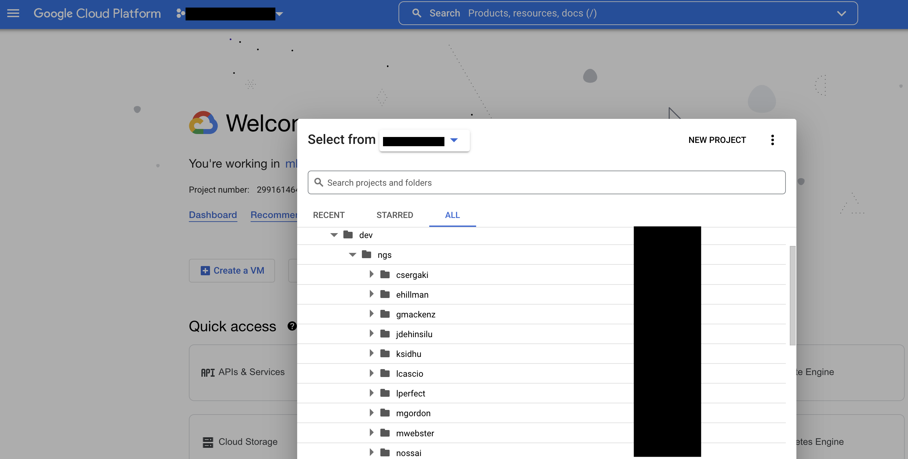

Your First GCP Session
========================

To access the Google Cloud console, follow the `link to the home page <https://console.cloud.google.com/>`_. 

Use your work account email address as the username and the GCP password provided to you. 

*Please reset your password upon logging if for the first time as this temporary password will expire 30 days after account creation.*

.. note::

    If you need help resetting your password please contact a member of the NGC core bioinformatics team or NTT support staff (khushwant.sidhu@nttdata.com, martin.webster@nttdata.com).

You will also need to set up two factor authentication on the account: see `walkthrough <https://support.google.com/accounts/answer/185839>`_.

You should now have access to the GCP console:

You can also interact with GCP via the CLI using the cloud SDK. 

Install the cloud SDK on your local machine following instructions `here <https://cloud.google.com/sdk/docs/install>`_. and enter the follow commands in your terminal:

``$ gcloud auth login``

``$ gcloud config set project YOUR_PROJECT_ID``

Google Cloud Projects
----------------------

Projects are used to organize all your Google Cloud resources, such as network, compute and storage resources.  

A project consists of a set of users; a set of APIs; and billing, authentication, and monitoring settings for those APIs. So, for example, all of your Cloud Storage buckets and objects, along with user permissions for accessing them, reside in a project.

To avail of these resources and other GCP services, you must have an active project.

Projects have been created for users under dev -> ngs. 

Click on the drop down menu beside the search bar on the homepage and select the project under your folder name:

You can also access GCP via the CLI using gcloud SDK.

Only you (and GCP admins) have access to the resources in your project.