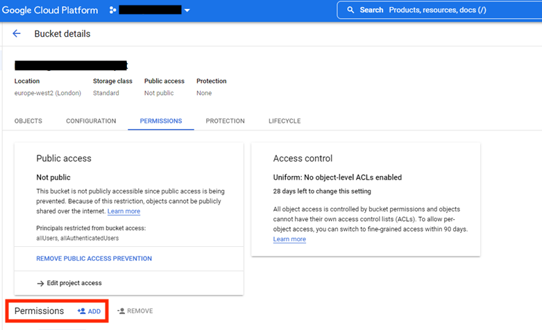
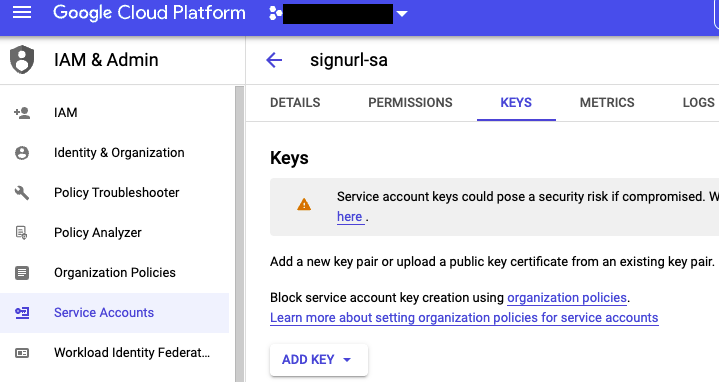

Data Sharing
==============

Overview
-------------

As touched on previously, Google Cloud Storage (GCS) uses object storage where each data unit is stored and associated with a unique URL for access and retrieval.

Data sharing is an important function and depending on the intended recipient, there are a number of options available for providing access to upload or retrieve data from GCS.  

Adding Principals to Storage Buckets
----------------------------------------

The easiest way to share data with other members of the agency with an active GCP account is to give users or groups (Principals in GCP parlance) direct access to a storage bucket in your project.

- Using the console, go to Cloud Storage and select the bucket containing the data. Move to the Permissions tag and select the add Principals option at the bottom of the page: 

- Add the Principal to the bucket (this will be a Google account (user, group or service account) and select the IAM role (level of access) you wish to confer. You can add multiple roles for fine-grained access control. In the example below I have given a user (\*\*\*@nibsc.org) listing and read-only access to the bucket.

- The internal user should now have access to bucekt objects. You can revoke access by removing the Principal from the resource.

Using Signed URLs
--------------------

To share data externally collaborator, please follow the approach outlined below for sharing signed URLs.

Signed URLS provide time-limited access to a cloud storage resource. This method is more secure than enabling public access for a storage bucket and was recommended by the service providers.

.. note::
    Further information on sharing data using signed URLs can be found `here <https://cloud.google.com/storage/docs/access-control/signing-urls-with-helpers>`_.

- Create a service account with ‘Storage Object Viewer’ role. Go to IAM & Admin -> Service Accounts -> Create. 

- Give the SA and give the ‘storage object viewer role’

.. image:: ../images/gcp-saobjectviewer.png
  :width: 800
  :alt: Object viewer permissions
 
- Create a json key from the service account. Go to IAM & Admin -> Service Accounts -> select the service account you created above -> keys tab -> add key (json format)

.. note::
    This will download the key locally. **Don’t store this key anywhere publicly visible as this could allow someone to access your service account!**
 
- Move json key to cloud shell. Upload key to cloud shell to your home directory (start cloud shell from the GCP console, select the 3 dots in top right of cloud shell header and upload the file)

.. image:: ../images/gcp-sajsonupload.png
  :width: 800
  :alt: Uploading json key via cloud shell

- Generate the signedURL with following commands:

.. code-block:: text

    # install python lib dependency
    pip3 install pyopenssl

    # example command: gsutil signurl -d duration path-to-json object-to-share 
    gsutil signurl -d 2d ~/PATH/TO/signedurl.json gs://mhra-ngs-singurl-test/bio-resources.zip
 

- You can copy and send this link to your collaborators to download the data. The link will work for duration set above

.. note::
    Ensure a dedicated service account is used (no other IAM role apart from Object Viewer) and remember to delete the key when download is completed

.. note::
    This section is intended for admin users will elevated privileges. If you need to share data externally, please contact the GCP admin team for support

SFTP Access To Google Cloud Storage
--------------------------------------

While the previous examples show how to provide access to a GCS bucket to a collaborator, the recipient must have a GCP account. This is not always possible, so to provide external access we must consider a work-around. 

One option is to setup a VM as a Secure File Transfer Protocol (SFTP) server and allow the clients to connect and access data in Cloud Storage. 

SFTP is an open specification for interacting with a remote file system to store, retrieve and list files in a hierarchical file system. SFTP exchanges all data with full encryption, meaning your data is secure in-transit.

Google doesn't provide out-of-the-box support for accessing GCS data through any of the File Transfer Protocols (FTP). Here we demonstrate one possible example how to setup access to GCS via SFTP and corresponding SFTP client tools.

The tool demonstrated is documented on github `here <https://github.com/kolban-google/sftp-gcs>`_. This program exposes itself as a SFTP server but uses Google Cloud Storage as the back-end storage system, meaning that (SFTP) clients can connect to the server and use standard sftp commands to retrieve, upload and/or list files in a linked storage bucket. 

From the perspective of the client, this behaves identically to interacting with any other file system, with the distinction that the data is housed in Cloud storage.

Here we will demonstrate how to set up & connect to the server and retrieve data from a named bucket:

- Select the standalone project configured to allow external connections & VM external IP addresses (details with NIBSC GCP admins)

- Create a VM to serve as SFTP server: 

.. code-block:: text
          
          # create through console or use gcloud command (sensitive info removed)
          
          gcloud compute instances create sftp-daemon \
          --project=xxxxxxxx --zone=europe-west2-a \
          --machine-type=e2-medium --network-interface=network-tier=STANDARD,subnet=xxxx-xxxx-eu-west2-1 \
          --maintenance-policy=MIGRATE --provisioning-model=STANDARD \
          --service-account=sftp-xxxxxxxxxx \
          --scopes=https://www.googleapis.com/auth/cloud-platform \
          --tags=ingress-xxxx,egress-xxxx \
          --create-disk=auto-delete=yes,boot=yes,device-name=sftp-daemon,image=projects/debian-cloud/global/images/debian-11-bullseye-v20220621,mode=rw,size=10,type=projects/xxxxxxxx/zones/us-central1-a/diskTypes/pd-balanced \
          --no-shielded-secure-boot --shielded-vtpm --shielded-integrity-monitoring --reservation-affinity=any

.. note::
    Remember to add network tags to enable required firewall rules. These can be found in the Firewall Rules section of the VPC GCP service

- Start the VM. To enable username-password access to the sftp server,  edit the sshd_config file containing ssh server configuration settings

.. code-block:: text

          sudo nano /etc/ssh/sshd_config

          #edit below line
          PasswordAuthentication no # change to PasswordAuthentication yes

- Save the file and restart SSH by running `sudo service ssh restart`

- This modification will allow an external user to connect to the sftp server using a specified username and password. However, we still need to allow connections between the VM sftp server and storage bucket. 

- For this we use a service account with Logging Admin and Storage Admin IAM roles (this is already available: sftp-xxxxxx ). To allow the VM to authenticate, create a service account json key: as above, go to IAM & Admin -> Service Accounts -> select the service account you created above -> keys tab -> add key (json format)

.. note::
    **Don’t store this key anywhere publicly visible and delete immediately after use to ensure others don't have access to the service account!**

- Next, upload the service account key to the VM as shown in the image. This will be saved in your home directory:

- Next, update the VM, clone the sftp-gcs repo and install dependencies

.. code-block:: text

          #update the VM
          sudo apt-get update

          #install java script nodejs runtime and git 
          sudo apt-get install nodejs git --yes

          #install npm package manager
          curl https://www.npmjs.com/install.sh | sudo sh

          #clone sftp-gcs repo
          git clone https://github.com/kolban-google/sftp-gcs

          # install dependencies for running the running the sftp daemon
          cd sftp-gcs && npm install

- Now start the sftp daemon 

.. code-block:: text

          # run the application and specify the sftp client username, password, target bucket and path to the SA json key. Substitute these for variables in the command below
          sudo node sftp-gcs --debug=debug --bucket=gs://${BUCKET} --port=122 --user=${USERNAME} --password=${PASSWORD} \
          --service-account-key-file ${SAJSON}

- A user can now connect to the server (and specified storage bucket) via sftp using username & password credentials (the client will also need to specify VMs external IP address).

- As an example below, I have set the client username and password to allow a client to connect using these credentials:

- The client can use these credentials to connect to the VM.

.. code-block:: text

          # connect over port 122. Enter password when prompted
          sftp -P122 sftptester@xx.xxx.xxx.xxx

- The client should now be able to retrieve/upload objects to the GCS bucket using standard SFTP commands! See SFTP command examples `here <https://www.tecmint.com/sftp-command-examples/#:~:text=How%20to%20Connect%20to%20SFTP,shell%20with%20an%20sftp%3E%20prompt>`_.

.. code-block:: text

          # upload local files to remote bucket
          sftp> put test.txt 

          # download files from bucket (downloaded to current local directory)
          sftp> get test.txt

          # close connection to server
          sftp> quit

.. note::
    Sometimes the connection can hang after executing `quit` command. This seems to be a bug. In these cases the connection can be closed from the server side.

- After data transfer is complete, clean up unneeded resources. **This is very important from a security perspective!** Checklist: 1) move data in the storage bucket to users bucket using `gsutil cp` 2) shutdown & delete the VM 3) delete the service account json key in IAM & Admin -> Service Accounts -> Keys