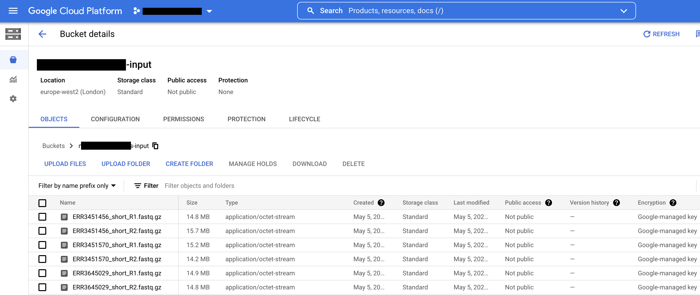

Data Storage & Access
=======================

Buckets & Object storage
-------------------------

Along with compute and network, storage is one of the fundamental Google Cloud resources. 

Unlike the on-site HPC which uses file storage, data in GCP is not stored and organized as a hierarchy of folders & files.  Instead, Google Cloud Storage uses object storage where each file is stored in as an object and accessed and retrieved using a unique identifier. 

Each object has a unique URL for which to access it. We will see how this can be useful for sharing data outside the environment later...

Cloud storage is cheap and provides excellent availability and durability. 

Cloud storage objects are organized into containers called *buckets*. 

All buckets are associated with a project. When you create a bucket you give it a globally-unique name, specify a geographic location where the bucket and its contents are stored and choose a storage class.

.. note::
    Pick a bucket location in the same region as your VMs to minimize latency


Bucket Creation & File Upload
-----------------------------------------

Buckets can be created and managed using:

- GCP console
- Cloud Shell
- Command Line with cloud SDK installed
 
**GCP Console**

- Search for cloud storage using the console search bar and click on the service
 
- To create a bucket, select 'Create Bucket'
 
- Give the bucket a unique name, select Europe-West2 as the location type, choose 'Standard' as the default storage class and ensure access control is set as 'Uniform'.



 
- To upload data to the bucket you have created, click on the bucket name in the console and select upload files/upload folder

.. note::
    Upload speeds can be quite slow for large files; consider using gsutil with multi-threading enabled
 


- To download or delete files/folders in a bucket, select the object in the bucket and choose Download/Delete option

 
**gsutil: Cloud Storage from the command line**
 
A faster, more flexible option for managing storage objects and buckets is the gsutil scripts included as part of the cloud SDK. 

Many of these gsutil commands work similarly to standard linux commands for file manipulation (cp, mv, rm, rsync etc). 

Some examples of common gsutil commands are included below:
 
- Create bucket
 
``$ gsutil mb -b -c "Standard" -l europe-west2 gs://{​​​​​​​BUCKET_NAME}​​​​​​​​​​​​​​``

.. note::
    gsutil mb parameters: ``-b``: uniform bucket-level access(on/off), ``-l``: location, ``-c``: storage class
 
- Copy file to bucket
 
``$ gsutil cp Desktop/example.png gs://{​​​​​​​​​​​​​​​​​​​​​​​​​​BUCKET_NAME}​​​​​​​​​​​​​​​​​​​​​​​​​​​​​​​​​​​​​​​​​​​​​​​``
 
- Create folder in bucket and copy file into it
 
.. note::
    On Google Cloud storage buckets have a 'flat' structure, meaning 'folders' are really just string prefixes added to object names


``$ gsutil cp gs://{​​​​​​​​​​​​​​​​​​​​​​​​​​​​​​​​​​​​​​​​​​​​​​​​​BUCKET_NAME}​​​​​​​​​​​​​​​​​​​​​​​​​​​​​​​​​​​​​​​​​​​/example.png gs://{​​​​​​​​​​​​​​​​​​​​​​​​​​​​​​​​​​​​​​​​​​​​​​​​​BUCKET_NAME}​​​​​​​​​​​​​​​​​​​​​​​​​​​​​​​​​​​​​​​​​​​/test-folder/example.png``
 
- List objects in bucket or folder
 
``$ gsutil ls gs://{​​​​​​​​​​​​​​​​​​​​​​​​​​​​​​​​​​​​​​​​​​​​​​​​​​​BUCKET_NAME}​​​​​​​​​​​​​​​​​​​​​​​​​​​​​​​``
 
- Download objects in bucket locally
``$ gsutil cp gs://{​​​​​​​​​​​​​​​​​​​​​​​​​​​​​​​​​​​​​​​​​​​​​​​​​​​​​BUCKET_NAME}​​​​​​​​​​​​​​​​​​​​​​​​​​​​​​​​​/example.png Desktop/example.png``
 
- Delete object in bucket
 
``$ gsutil rm gs://{​​​​​​​​​​​​​​​​​​​​​​​​​​​​​​​​​​​​​​​​​​​​​​​​​​​​​BUCKET_NAME}​​​​​​​​​​​​​​​​​​​​​​​​​​​​​​​​​/example.png``
 
- Delete bucket and all objects stored within recursively
 
``$ gsutil rm -r gs://my-awesome-bucket``
 
.. note::
    For further information, see gsutil documentation: ``gsutil --help`` and quick start information `here <https://cloud.google.com/storage/docs/quickstart-gsutil>`_.

Mounting Buckets to VMs using GCSFuse
----------------------------------------------

While our GCP environment does not have shared file storage, a tool called gcsFuse can be used to mount storage buckets onto virtual machines (VMs)

This allows users on VMs to interact with storage objects in mounted buckets as they would on a standard shared file storage system.

Input and output buckets have been created for you and automatically mounted to Virtual Machine (VM) folder ``gcsfuse``` for VMs created from the instance templates

You can follow the instructions below to mount and unmount additional buckets using gcsfuse.
 
.. note::
    Before invoking gcsfuse, you must have a GCS bucket that you want to mount. 
    If the bucket doesn't exist, create it first following instructions in previous section
 
Say you want to mount the GCS bucket called ``gs://my-bucket``


- First create the directory into which you want to mount the gcsfuse bucket, then run gcsfuse: 
 
``$ mkdir /path/to/mount/point``

``$ gcsfuse gs://my-bucket /path/to/mount/point``
 
- Check the bucket has been mounted successfully

``$ ls /path/to/mount/point``
 
- On Linux, you can unmount the buckets using fuse's fusermount tool:
 
``$ fusermount -u /path/to/mount/point``                                                                   
 
- On OSX unmount by running the below command:
``umount /path/to/mount/point``
 
.. note::
    Reading and writing to a mounted bucket has much higher latency than a local file system. If you need to increase IOPs, consider attaching a local storage disk to the VM instance and storing data here instead. 
    
.. note::   
    GCS object names map directly to file paths using the separator ``/`` Object names ending in a ``/`` represent a directory, and all other object names represent a file. Directories are by default not implicitly defined; they exist only if a matching object ending in a slash exists. For example, say that you use a nextflow pipeline to create a folder and associated objects such as ``fastqc-logs/fastqc.html``. The file system will initially appear empty, since no ``fastqc-logs/`` folder exists in the mounted directory. To circumvent this, run ``mkdir fastqc-logs`` you will now see a directory named "fastqc-logs" containing a file named "fastqc.html".
 
.. note::
    Further information on mounting storage via gcsfuse can be found on `github <https://github.com/GoogleCloudPlatform/gcsfuse>`_.