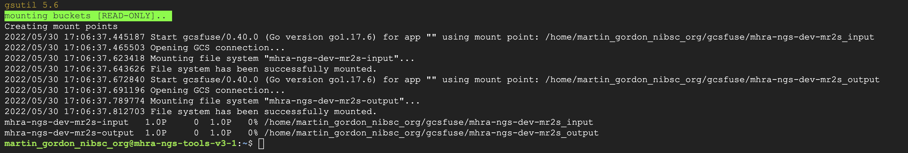
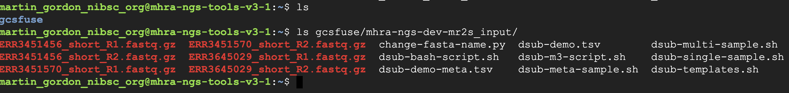
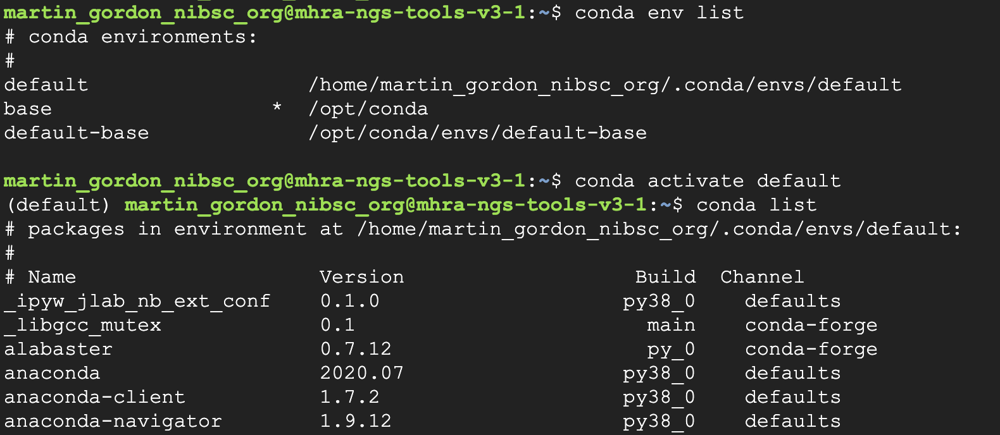
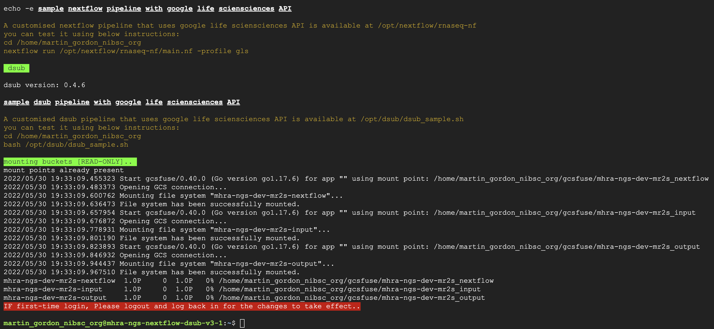
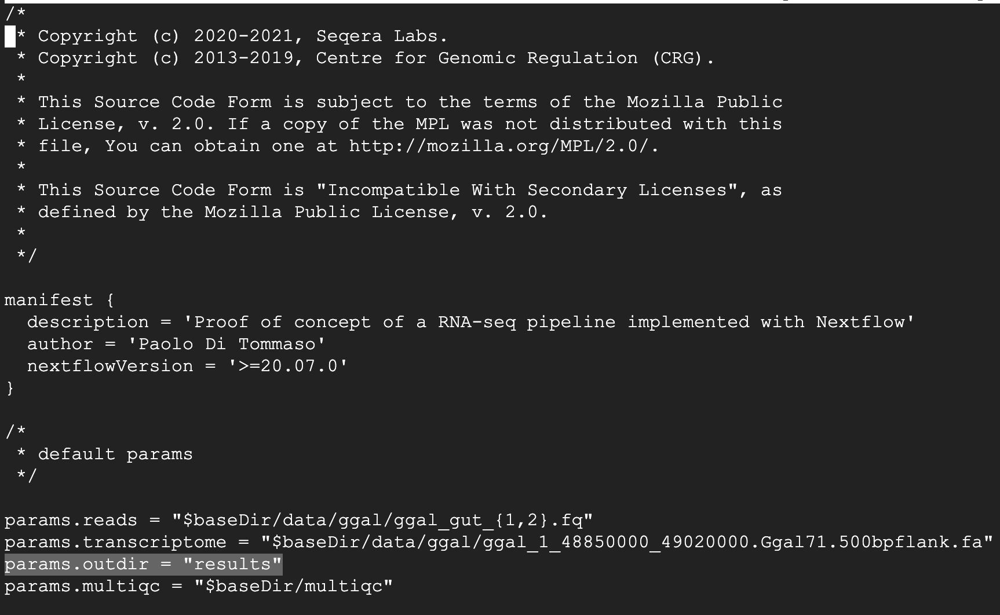
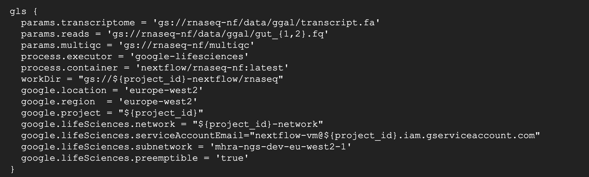
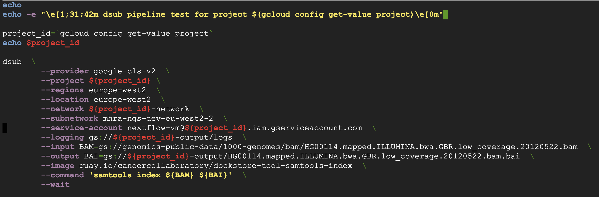
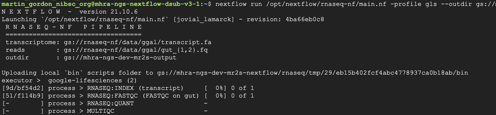

Example Workflows
==================

Here we provide a brief walkthrough for running basic workflows on VM's created from the instance templates.

.. note::
    Methods listed here may change to better represent best working practices. We encourage users to adapt the workflows as needed and suggest improvements to help us improve the service for everyone!
 
mhra-ngs-tools
----------------
 
**Using Conda**
 
- Create a VM from the mhra-ngs-tools instance template using the instructions in 'Creating VM's' section of the wiki.
 
- ssh onto the VM. Allow some time for system boot-up and software installations. When the environment is ready, you shoudl see a prompt similar to the image below. The VM is now ready for use!

.. note::
    You can check see from the boot-up message that three buckets have been automatically mounted: `${​​​​​​​PROJECT-ID}​​​​​​​-input`, `${​​​​​​​​​​​​​​​​​​​​​​​​​​​​​​​​​​​​​​​​​​​​​​​​​​​​​​​​​​​​​​​​​​​​​​​​​​​​​​​​​​​​​​​​​​​​​​​​​​​​​​​​​​​​​​​​​​​​​​​​​​​​​​​​​​​​​​​​​​​​​​​​​​​​​​​​​​​​​​​​​​​​​​​​​​​​​​​​​​​​​​​​​​​​​​​PROJECT-ID}​​​​​​​​​​​​​​​​​​​​​​​​​​​​​​​​​​​​​​​​​​​​​​​​​​​​​​​​​​​​​​​​​​​​​​​​​​​​​​​​​​​​​​​​​​​​​​​​​​​​​​​​​​​​​​​​​​​​​​​​​​​​​​​​​​​​​​​​​​​​​​​​​​​​​​​​​​​​​​​​​​​​​​​​​​​​​​​​​​​​​​​​​​​​​​​​​​​​​​​​​​​​​​​​​​​​​​​​​​​​​​​​​​​​​​​​​​​​​​​​​​​​​​​​​​​​​​​​​​​​​​​​​​​​​​​​​​​​​​​​​​​​​​​​​​​​​​​​​​​​​​​​​​​​​​​​​​​​​​​​​​​​​​​​​​​-out` and `${​​​​​​​​​​​​​​​​​​​​​​​​​​​​​​​​​​​​​​​​​​​​​​​​​​​​​​​​​​​​​​​​​​​​​​​​​​​​​​​​​​​​​​​​​​​​​​​​​​​​​​​​​​​​​​​​​​​​​​​​​​​​​​​​​​​​​​​​​​​​​​​​​​​​​​​​​​​​​​​​​​​​​​​​​​​​​​​​​​​​​​​​​​​​​​​PROJECT-ID}​​​​​​​​​​​​​​​​​​​​​​​​​​​​​​​​​​​​​​​​​​​​​​​​​​​​​​​​​​​​​​​​​​​​​​​​​​​​​​​​​​​​​​​​​​​​​​​​​​​​​​​​​​​​​​​​​​​​​​​​​​​​​​​​​​​​​​​​​​​​​​​​​​​​​​​​​​​​​​​​​​​​​​​​​​​​​​​​​​​​​​​​​​​​​​​​​​​​​​​​​​​​​​​​​​​​​​​​​​​​​​​​​​​​​​​​​​​​​​​​​​​​​​​​​​​​​​​​​​​​​​​​​​​​​​​​​​​​​​​​​​​​​​​​​​​​​​​​​​​​​​​​​​​​​​​​​​​​​​​​​​​​​​​​​​​-nextflow`. All three are mounted under `gcsfuse` folder in your home directory. You can use these buckets or create new buckets and mount them using gcsfuse.

- Upload data to a storage bucket. You can upload some test fastQ files to these buckets using either the GCP console or gsutil. You can use the available buckets or create new buckets and mount using gcsfuse.
 
- I am using gsutil, which is installed on hpc-scratch as shown below. See gsutil section for user authentication and configuration set-up.

- View buckets available on your project

.. code-block:: text

    #  on hpc-scratch

    # first authenticate with GCP user account
    $ google init --console-only

    # list buckets 
    $ gsutil ls
 
    # copy data (`-m` for parallel transfer)
    $ gsutil -m cp *.fastq.gz gs://mhra-xxx-xxx-xxx-input

-You can now view these objects in your storage bucket. Check the data is mounted on your vm:

​​​​​​
We will now create a conda environment, install a standard tool (cutadapt) and run this on the mounted input folder. 

Processed output will be written to a mounted output bucket

.. note::
    It is not possible to read or write to Cloud Storage directly. Objects must be either **1.** copied/moved back and forth from VM using gsutil or **2.** the storage bucket mounted on the local machine using gcsfuse
 
.. note::
    You can write this to the local machine but beware disk space limitations. Disk space can be increased on VM at start-up, or you attach a additional disks. **Beware this data will be lost on VM deletion unless it is backed up elsewhere!**

- Three conda environments are available in the image by default. The default environment contains many tools preinstalled - you can view these tools by activating the environment and running `$conda list` 

 
- To run this workflow, we will be creating a new conda environment. Run the code below to create a new environment and install latest version of cutadapt

.. code-block:: text

    $ conda create -n cutadapt cutadapt
    
    # check environment is ready 
    cutadapt -h

- Run cutadapt on data in the mounted input bucket and write output to the mounted output bucket (you could also wrap this in a bash script). 

.. code-block:: text
    
    #trim read pairs
    for in1 in ./gcsfuse/mhra-ngs-dev-mr2s_input/*_R1.fastq.gz; do in2=${in1/R1.fastq.gz/R2.fastq.gz}; R1=$(basename $in1); R2=$(basename $in2); OUTDIR='./gcsfuse/mhra-ngs-dev-mr2s_output';cutadapt -q 30 -o ${OUTDIR}/${R1/_R1.fastq.gz/_trimmed_R1.fastq.gz} -p ${OUTDIR}/${R2/_R2.fastq.gz/_trimmed_R2.fastq.gz} $in1 $in2;done

- Check the output bucket for the trimmed data. 

.. code-block:: text

    ls ./gcsfuse/mhra-ngs-dev-mr2s_output

**Using Singularity**
 
- Singularity is pre-installed on the VM created from the ngs-tools template. The workflow is very similar to the conda workflow above.
 
- Check the singularity version. Run `singularity pull` to pull an image from one of the public registries. You can also use this command to pull docker images and create singularity image files (.sif) from them. For the purposes of this tutorial, we will pull a docker image of the cutadapt tool from DockerHub (note the `://docker` prefix below)

.. code-block:: text
    
    # pull latest cutadapt singularity container from DockerHub
    $ singularity pull cutadapt.sif docker://kfdrc/cutadapt

    # enter container 
    $ singularity shell cutadapt.sif

    # check cutadapt is working
    Singularity> cutadapt -h

- Run the cutadapt command above to write data to the output bucket. Check the bucket to confirm the data is there

.. note::
    Some directories are automatically mounted into the container by default (special auto bind mount directories include: `$HOME` `/tmp` `/proc` `/sys` `/dev` ) As gcsfuse folder is in `$HOME`, you don't need to do anything extra. To mount additional directories use option or set the environmental variable (`--bind  $SINGULARITY_BINDPATH`)

.. note::
    While the service account used to access the VM has bucket write permissions, it does not have permissions to modify objects i.e. you can't overwrite, alter or delete items in the bucket from the VM. This is a security measure to ensure service accounts do not have excess permissions. To remove items from buckets, you need user account privileges (i.e use the console or cloud shell)
 
.. note::
    Resources: `conda documentation <https://docs.conda.io/projects/conda/en/latest/user-guide/index.html>`_. , `conda cheatsheet <https://docs.conda.io/projects/conda/en/4.6.0/_downloads/52a95608c49671267e40c689e0bc00ca/conda-cheatsheet.pdf>`_. , `singularity documentation <https://sylabs.io/guides/3.5/user-guide/introduction.html>`_., `singularity tutorial <https://singularity-tutorial.github.io/>`_.

mhra-ngs-nextflow-dsub 
-----------------------
 
**Nextflow example workflow**
 
Nextflow is a workflow management software used by bioinformaticians to integrate all of their bash/python/perl/other scripts into a one cohesive workflow. 

Nextflow allows users to create scalable, modular and reproducible scientific workflows underpinned by software (docker/singularity/conda) containers.
 
Nextlfow integrates nicely with GCP Google Life Science API, which runs in the background and manages compute engine resources (ie configure, create and destroy VMs) as required by the pipeline processes. With a single command, you can launch a Nextflow pipeline composed of several processes each associated with their own container, and Nextflow and GCP will orchestrate the workflow for you!
 
Below we provide instructions on running a toy nextflow pipeline inside the VM. Both Nextlfow and the pipeline have been installed for you on the mhra-ngs-nextflow-dsub instances. 
 
- Create a VM from the mhra-ngs-nextflow-dsub instance template using the instructions provided previously.
 
- ssh onto the VM. Allow some time for system boot-up and software installations. When the envinronment is ready, you shoudl see a prompt similar to the image below. The VM is now ready for use!
 
- You can check see from the boot-up message that three buckets have been automatically mounted: `${​​​​​​​​​​​​​​​​​​​​​​​​​​​​​​​​​​​​​​​​​​​​​​​​​​​​​​​​​​​​​​​​​​​​​​​​​​​​​​​​​​​​​​​​​​​​​​​​​​​​​​​​​​​​​​​​​​​​​​​​​​​​​​​​​​​​​​​​​​​​​​​​​​​​​​​​​​​​​​​​​​​​​​​​​​​​​​​​​​​​​​​​​​​​​​​​​​​​​​​​​​​​​​​​​​​​​​​​​​​PROJECT-ID}​​​​​​​​​​​​​​​​​​​​​​​​​​​​​​​​​​​​​​​​​​​​​​​​​​​​​​​​​​​​​​​​​​​​​​​​​​​​​​​​​​​​​​​​​​​​​​​​​​​​​​​​​​​​​​​​​​​​​​​​​​​​​​​​​​​​​​​​​​​​​​​​​​​​​​​​​​​​​​​​​​​​​​​​​​​​​​​​​​​​​​​​​​​​​​​​​​​​​​​​​​​​​​​​​​​​​​​​​​​​​​​​​​-input` and `${​​​​​​​​​​​​​​​​​​​​​​​​​​​​​​​​​​​​​​​​​​​​​​​​​​​​​​​​​​​​​​​​​​​​​​​​​​​​​​​​​​​​​​​​​​​​​​​​​​​​​​​​​​​​​​​​​​​​​​​​​​​​​​​​​​​​​​​​​​​​​​​​​​​​​​​​​​​​​​​​​​​​​​​​​​​​​​​​​​​​​​​​​​​​​​​​​​​​​​​​​​​​​​​​​​​​​​​​​​​​​​​​​​​​​​​​​​​​​​​​​​​​​​​​​​​​​​​​​​​​​​​​​​​​​​​​​​​​​​​​​​​​PROJECT-ID}​​​​​​​​​​​​​​​​​​​​​​​​​​​​​​​​​​​​​​​​​​​​​​​​​​​​​​​​​​​​​​​​​​​​​​​​​​​​​​​​​​​​​​​​​​​​​​​​​​​​​​​​​​​​​​​​​​​​​​​​​​​​​​​​​​​​​​​​​​​​​​​​​​​​​​​​​​​​​​​​​​​​​​​​​​​​​​​​​​​​​​​​​​​​​​​​​​​​​​​​​​​​​​​​​​​​​​​​​​​​​​​​​​​​​​​​​​​​​​​​​​​​​​​​​​​​​​​​​​​​​​​​​​​​​​​​​​​​​​​​​​​​​​​​​​​​​​​​​​​​​​​​​​​​​​​​​​​​​​​​​​​​​​​​​​​​​-out`, and `${​​​​​​​​​​​​​​​​​​​​​​​​​​​​​​​​​​​​​​​​​​​​​​​​​​​​​​​​​​​​​​​​​​​​​​​​​​​​​​​​​​​​​​​​​​​​​​​​​​​​​​​​​​​​​​​​​​​​​​​​​​​​​​​​​​​​​​​​​​​​​​​​​​​​​​​​​​​​​​​​​​​​​​​​​​​​​​​​​​​​​​​​​​​​​​​​​​​​​​​​​​​​​​​​​​​​PROJECT-ID}​​​​​​​​​​​​​​​​​​​​​​​​​​​​​​​​​​​​​​​​​​​​​​​​​​​​​​​​​​​​​​​​​​​​​​​​​​​​​​​​​​​​​​​​​​​​​​​​​​​​​​​​​​​​​​​​​​​​​​​​​​​​​​​​​​​​​​​​​​​​​​​​​​​​​​​​​​​​​​​​​​​​​​​​​​​​​​​​​​​​​​​​​​​​​​​​​​​​​​​​​​​​​​​​​​​​-nextflow`. The buckets are mounted under gcsfuse folder in your home directory

- With a newly created VM, you must first exit the VM and ssh back in. This is necessary to initialise Docker installation.
 
- You can check where nextflow is installed using the 'which' command:

.. code-block:: text
    
    $ which nextflow #/opt/nextflow/nextflow
 
- Before running the toy RNAseq nextflow pipeline, we must first check if the pipeline has been configured correctly. You can see from the VM start-up message the rnaseq-nf pipeline is installed under `/opt/nextflow`. Run the following command to inspect the configuration file for the rnaseq-nf pipeline:

.. code-block:: text
    
    # open the nextflow configuration file
    nano /opt/nextflow/rnaseq-nf/nextflow.config

- You can see the config file specifies that the pipeline output location has been set to a results directory in `$HOME` on the VM (this folder will be created by the pipeline run). We would like to modify this to store data in a Google Storage bucket as **1)** disk space is limited on the VM and **2)** data in storage is more secure long-term as everything stored in a VM is lost if it is deleted!

.. note::
  
  Disk space can be increased by customizing the VM at start-up. You can also attach a secondary disk to the VM if needed

To write output to storage, you can either **1)** edit line 26 in the config file (`params.outdir = "results"`) to redirect output to a storage bucket or **2)** specify `--outdir $BUCKETNAME` when launching the pipeline. We will do the latter.
​​​​​​

Lets take a look at some of the other pipeline pre-set configurations. Scroll down to line 66 to see the gls execution profile for the Google Life Science environment:

Profiles are a set of configuration attributes that are activated when launching a nextflow pipeline execution by using the '-profile' command line option. They essentially control how the pipeline is executed.

Important profile configurations include:

- **process.executor:** the executor is the nextflow component that determines the system where a pipeline is run and supervises it's execution. Other options for different environments include slurm and local among others. 
- **google.location:** the Google locations where the job executions are deployed to Google Life Sciences API
- **google.region:** Google region where compute is executed
- **google.project:** The Google project associated with the pipeline 
- **google.lifesciences.network:** The network to attach the VM network interface to 
- **google.lifesciences.serviceAccountEmail:** The Google service account used for the pipeline execution
- **google.lifesciences.subnetwork:** The name of the subnetwork to attach the VM instance to
 
For more information on different profile options available, check out the configuration options in the Google Cloud section of the Nextlfow `documentation <https://www.nextflow.io/docs/latest/google.html>`_.
 
-  Now we are ready to run the pipeline! cd to `$HOME` and run the following command:

.. code-block:: text
    
    # write output to a bucket
    nextflow run /opt/nextflow/rnaseq-nf/main.nf -profile gls --outdir gs://${BUCKET_NAME}

- You should see the Nextflow welcome message and pipeline start-up. You can see progress on the different processes and their associated work directories.

- You will also notice that the scripts are exported to a work directory bucket. The current VM serves only kick start the pipeline, with the computation performed in VMs spun up by Google Life Science API.

..  note::
    If you refresh the VM instances page on the GCP console (or run `gcloud compute instances list` on command line) you will see the Google Life Sciences API has created new VMs to execute the pipeline processes. These will be spun down automatically after processes has completed.
 
- After the pipeline has completed, check your output bucket for the results. You can also look inside the `${​​​​​​​​​​​​​​​​​​​​​​​​​​​​​​​​​​​​​​​​​​​​​​​​​​​​​​​​​​​​​​​​​​​​​​​​​​​​​​​​​​​​​​​​​​​​​​​​​​​​​​​​​​​​​​​​​​​​​​​​​​​​​​​​​​​PROJECT_ID}​​​​​​​​​​​​​​​​​​​​​​​​​​​​​​​​​​​​​​​​​​​​​​​​​​​​​​​​​​​​​​​​​​​​​​​​​​​​​​​​​​​​​​​​​​​​​​​​​​​​​​​​​​​​​​​​​​​​​​​​​​​​​​​​​​​-nextflow` bucket, which for our tutorial functions as the work/scratch directory for the pipeline. It holds the transitory files and info on the processes and commands run.

.. note::
    The work directory can be very useful for troubleshooting and investigating issues with your pipeline run
 
- You might also want to access these files in the mounted directories. Notice that if you look inside the output folder the fastqc_gut_logs folder and it's output seems to be missing...

- This is a quirk of the gcsfuse software, where directories created by external processes are not implicitly defined (see storage section of wiki on gcsfuse for further info). To view these files in the mounted directly, simply create a directory named 'fastqc_gut_logs')

.. code-block:: text
    
    # create output folder for 
    mkdir gcsfuse/mhra-ngs-dev-mr2s_output/fastqc_gut_logs

You have now seen how to configure and run a nextflow pipeline on a VM using the Google Life Science API!
 
.. note::
    Resources: `Nextflow documentation <https://www.nextflow.io/docs/latest/index.html>`_, `NF-core pipelines <https://nf-co.re/​​​​​​​>`_, `Google Life Science API documentation <https://cloud.google.com/life-sciences/docs​​​​​​​>`_, `Nextflow tutorial on GCP: <https://cloud.google.com/life-sciences/docs/tutorials/nextflow>`_.
 
**Dsub example workflow**
 
Dsub is a commmand-line tool that allows you to submit and run containerised batch jobs in cloud computing environments. Dsub is modelled after traditional high-performance computing job schedulers like SLURM. 

Similar to Nextflow, Dsub also uses the Google Life Science API as backend executor to run batch jobs. Dsub can be considered somewhat analogous to submitting and executing batch jobs on the HPC.
 

- Follow steps 1-4 for the Nextflow workflow above.
 
- Once you have ssh'ed back into the machine, check that dsub is installed:

.. code-block:: text
    
    $ which dsub # /usr/local/bin/dsub

- Open the bash script containing the dsub test job submission script

.. code-block:: text
    
    $ nano /opt/dsub/dsub_sample.sh

- Dsub job scripts share some overlap with the nextflow config file. Some of the key parameters are:

    
- **provider:** the executor for the dsub job. Can be set to 'local' for testing
- **project:** the Google project where the pipeline is to be run
- **region:** compute engine zone where pipeline task are to be run
- **location:** Location for job submission to the Google Life Sciences API
- **service-account:** email address for the service-account authenticated with the VM
- **image:** docker image containing the software necessary to run the workflow
- **network:** network VM is connected to via the VM network interface
- **input/output:** input and output for the pipeline. Notice how these have been assigned to bash variables and which can be called when executing the pipeline
- **command:** ​​​​​​​The command executed 

Options for dsub job submissions are very flexible. Similar to sbatch, you can also submit as script as a task instead of a command by substituting the `--command` option with `--script` parameter and providing the path to the script. You are also not limited to running bash scripts - check out dsub script examples on `Github <https://github.com/DataBiosphere/dsub/tree/main/examples/custom_scripts>`_.
 
You can also submit a list of files to be run as multiple tasks by supplying a tsv file with sample input and output information to the `--task` parameter in place of `--input` and `--output`. You can find some example scripts `here <https://github.com/MGordon09/gcp-scripts/tree/main/dsub-examples>`_.

- Exit the script and execute it from your home directory:

.. code-block:: text
    
    $ bash /opt/dsub/dsub_sample.sh

- You will see tasks spawned by dsub and executed in compute engine VMs spawned by the GLS API. Once the pipeline has completed successfully, you will see a 'SUCCESS' message appear on screen.

- Check your storage buckets to confirm output has been stored there.

.. note::
    Resources: `dsub tutorial on Google Cloud <https://cloud.google.com/life-sciences/docs/tutorials/dsub>`_., `dsub github homepage <https://github.com/DataBiosphere/dsub​​​​​​​>`_.